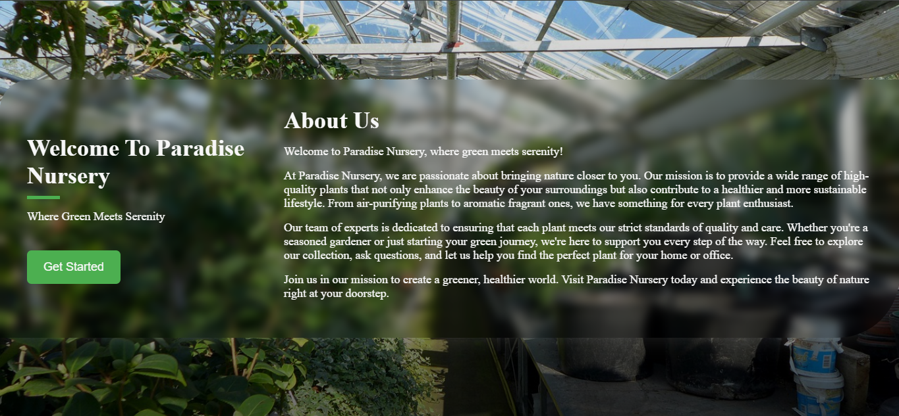
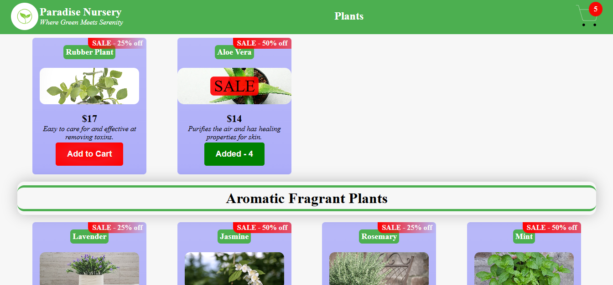
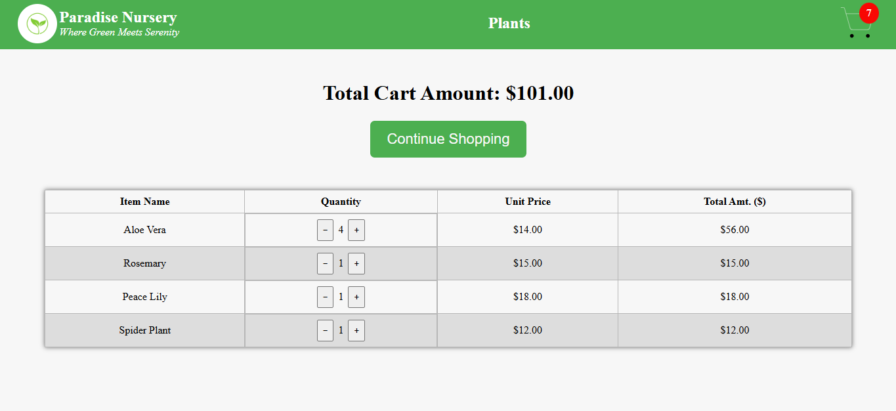

# 🌿 Plant | Nursery Shopping - React + Redux E-Commerce App





## 🛍️ Overview

**Plant | Nursery Shopping** is a simple e-commerce web application built using **React, Redux Toolkit, and Vite**. It allows users to browse, add, and manage plant items in their cart, providing a seamless shopping experience.

---

## 🚀 Features

✅ **Browse Plants** – View various plant categories like Air Purifying, Medicinal, Aromatic, and more.  
✅ **Add to Cart** – Click a button to add items to the cart with real-time quantity updates.  
✅ **Cart Management** – View cart items, adjust quantity, and remove plants as needed.  
✅ **Checkout Feature** – Displays total cart amount and allows quantity updates before checkout.  
✅ **Redux Store** – Uses **Redux Toolkit** for efficient state management.  
✅ **Responsive UI** – Fully mobile-friendly and easy to navigate.

---

## Technologies Used

- React – Component-based UI development.
- Redux Toolkit – State management for cart functionality.
- Vite – Fast development server & bundler.
- CSS Modules – Styling with modular approach.

## Setup Instructions

To run the project locally, follow these steps:

### 1. Clone the repository

```bash
git clone https://github.com/abhisekumarjha/NurseryShopping.git
cd NurseryShopping
```

### 2. Install dependencies

```bash
npm install
```

### 3. Run the application

```bash
npm run dev
```

## Live At 🔗

**_[https://nurseryshopping-jha.vercel.app/](https://nurseryshopping-jha.vercel.app)_**
